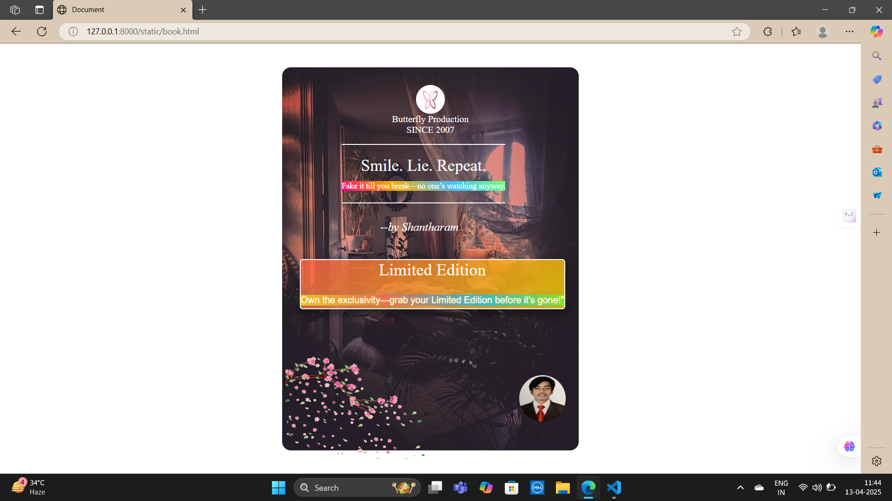

# Ex.04 Book Front Cover Page Design
## Date: 13-04-2025

## AIM:
To design a book front cover page using HTML and CSS.

## DESIGN STEPS:

### Step 1:
Create a Django Admin project.

### Step 2:
Create an app in the Django interface.

### Step 3:
Create a folder named 'static' in the app folder.

### Step 4:
Create a new HTML file in the static folder.

### Step 5:
Write the HTML code with relevant CSS properties.

### Step 6:
Choose the appropriate style and color scheme.

### Step 7:
Insert the images in their appropriate places.

### Step 8:
Publish the website in the LocalHost.

## PROGRAM:
```
<html lang="en">
<head>
    <meta charset="UTF-8">
    <meta name="viewport" content="width=device-width, initial-scale=1.0">
    <title>Document</title>
    <style>
        .production{
            height: 50px;
            width: 50px;
            border-radius: 50%;
            margin-bottom: 0;
        }
        .since{
            margin-top: 0;
        }
        body{
            margin: 0;
            padding: 0;
            overflow: hidden;
            display: flex;
            align-items: center;
            justify-content: center;
        }
        .outline{
            width: 450px;
            height: 600px;
            color: white;
            text-align: center;
            border-radius: 15px;
            padding: 30px;
            position: relative;
            background-image: url("9ac3d81f5f993f1b7a33dc58c34b345f.jpg");
            background-size: cover;
            background-repeat: no-repeat;
            background-position: center;
        }
      
        .book-title{
            position: absolute;
            top: 20%;
            left: 20%;
            font-size: 28px; 
            border-top: 2px solid white; 
            border-bottom: 2px solid white; 
            padding: 20px 0;

        }
        .prologue{
            font-size: 14px;
            background: linear-gradient(45deg, #ff007f, #ffae00, #47bfff, #76ff76);
            display: inline-block;
            margin-top: 10px;
        }
        .author-name {
            font-size: 20px;
            font-style: italic;
            margin-bottom: 20px; 
            position: absolute;
            top: 40%;
            left: 33%;
        }
        .author-photo{
            width: 80px;
            height: 80px;
            border-radius: 50%;
            position: absolute;
            bottom: 50px;
            left: 80%;
        }
        .edi{
            border: 2px solid white;
            position: absolute;
            top: 50%;
            border-radius: 5px;
            box-shadow: 0 8px 20px rgba(0, 0, 0, 0.5);
            background: linear-gradient(135deg, rgba(255, 99, 71, 0.8), rgba(255, 215, 0, 0.8));
        }
        .imp{
            display: inline-block;
            margin-top: 8px;
            margin-bottom: 5px;
            background: linear-gradient(45deg, #FFD700, #FF6347, #00BFFF, #7FFF00); 
            text-shadow: 0 0 5px #FFD700, 0 0 10px #FF6347, 0 0 15px #00BFFF; 
            font-family: 'Arial'
        }
        .le{
            font-size: 29px;
            margin: 0;
        }
        .last-img{
            height: 180px;
            width: 250px;
            position: absolute;
            top: 75%;
            left: 5px;
        }
    </style>
</head>
<body>
    <div class="outline">
        
        <p class="since">Butterfly Production <br> SINCE 2007</p>
    <div class="content-box">
        <div class="book-title">
            Smile. Lie. Repeat.
            <br>
           <span class="prologue">Fake it till you break—no one’s watching anyway.</span>
        </div>
        <div class="author-name">
            --by Shantharam
        </div>
        <div class="edi">
            <p class="le">Limited Edition</p>
            <br>
            <span class="imp">Own the exclusivity—grab your Limited Edition before it's gone!"</span>
        </div>
    </div>
         
        
    </div>
    
</body>
</html>
```

## OUTPUT:


## RESULT:
The program for designing book front cover page using HTML and CSS is completed successfully.
